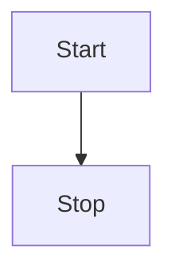

## 😲 md-editor-rt

Markdown Editor for React, developed by jsx and typescript, support different themes、beautify content by prettier.

### 🤖 Base

**bold**, <u>underline</u>, _italic_, ~line-through~, superscript<sup>26</sup>，subscript<sub>[1]</sub>，`inline code`，[link](https://imzbf.cc)

> quote：hahaha

## 🤗 Demo

```js
import { defineComponent, ref } from 'vue';
import MdEditor from 'md-editor-rt';
import 'md-editor-rt/lib/style.css';

export default defineComponent({
  name: 'MdEditor',
  setup() {
    const text = ref('');
    return () => (
      <MdEditor modelValue={text.value} onChange={(v: string) => (text.value = v)} />
    );
  }
});
```

## 🖨 Text

The Old Man and the Sea served to reinvigorate Hemingway's literary reputation and prompted a reexamination of his entire body of work.

## 📈 Table

| nickname | age | from            |
| -------- | --- | --------------- |
| zhijian  | 3   | China ChongQing |

## 🧬 Diagram



## ☘️ em...
